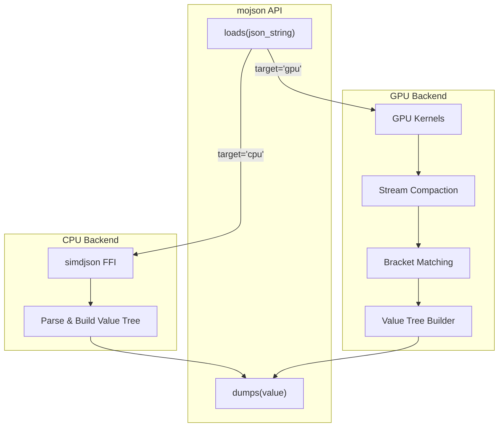
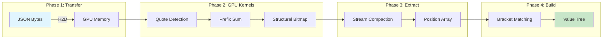

# mojson - High-Performance JSON for Mojo

Fast JSON parsing library for Mojo with Python-compatible API and GPU acceleration.

## Performance

### GPU: 1.85x Faster than cuJSON (NVIDIA)

| Parser | Throughput | Speedup |
|--------|------------|---------|
| cuJSON (CUDA C++) | 4.6 GB/s | baseline |
| **mojson GPU** | **8.5 GB/s** | **1.85x faster** |

*Benchmark: 804MB twitter_large_record.json on NVIDIA B200 GPU*

### GPU: Apple Silicon (Mac)

| Metric | Time | Throughput |
|--------|------|------------|
| Raw GPU parse | 270 ms | 3.1 GB/s |
| Pinned memory path | 257 ms | 3.3 GB/s |
| Full `loads[target='gpu']` | 498 ms | 1.7 GB/s |

*Benchmark: 804MB twitter_large_record.json on Apple M3 Pro GPU*

### CPU

Uses [simdjson](https://github.com/simdjson/simdjson) under the hood via FFI for maximum compatibility and performance.

## Architecture



## GPU Pipeline



## Why mojson is Faster

| Optimization | Impact |
|--------------|--------|
| **GPU Stream Compaction** | Reduces D2H transfer from 160ms to 50ms (main speedup) |
| **Pinned Memory** | Fast H2D transfer (~15ms) |
| **Hierarchical Prefix Sums** | Efficient parallel scans using block primitives |
| **Fused Kernels** | Single-pass quote detection + structural bitmap |

## Quick Start

```bash
# Clone with submodules (for benchmark reproducibility)
git clone --recursive https://github.com/user/mojson.git
cd mojson

# Install dependencies + auto-build FFI
pixi install

# Run tests
pixi run tests-cpu  # CPU tests
pixi run tests-gpu  # GPU tests
```

## Examples

See the `examples/` directory for complete working examples:

```bash
pixi run examples         # Run all examples
# Or run directly
pixi run mojo -I . examples/01_basic_parsing.mojo
```

| Example | Description |
|---------|-------------|
| `01_basic_parsing.mojo` | Parse JSON strings, serialize back, handle all JSON types |
| `02_file_operations.mojo` | Read/write JSON files with `load()` and `dump()` |
| `03_value_types.mojo` | Type checking (`is_*`), value extraction (`*_value()`), metadata |
| `04_gpu_parsing.mojo` | GPU-accelerated parsing with `loads[target="gpu"]()` |
| `05_error_handling.mojo` | Try/except error handling, batch processing with recovery |

## Usage

```mojo
from mojson import loads, dumps

# CPU (default) - like Python's json.loads()
var data = loads('{"name": "Alice", "age": 30}')

# GPU acceleration for large files
var data = loads[target="gpu"](large_json_string)

# Serialize - like Python's json.dumps()
print(dumps(data))

from mojson import load, dump

# File operations - like Python's json.load() / json.dump()
with open("data.json", "r") as f:
    var config = load(f)              # CPU (default)
    var config = load[target="gpu"](f)  # GPU

with open("output.json", "w") as f:
    dump(data, f)
```

## API

| Function | Description |
|----------|-------------|
| `loads(s)` | Parse JSON string (CPU) |
| `loads[target="gpu"](s)` | Parse JSON string (GPU) |
| `dumps(v)` | Serialize Value to JSON |
| `load(f)` | Parse from FileHandle |
| `dump(v, f)` | Serialize to FileHandle |

## Value Type

```mojo
# Type checking
v.is_null() / is_bool() / is_int() / is_float() / is_string() / is_array() / is_object()

# Value extraction
v.bool_value() / int_value() / float_value() / string_value()
```

## Benchmarks

```bash
# CPU benchmark
pixi run bench-cpu

# GPU benchmark (804MB file)
pixi run bench-gpu benchmark/datasets/twitter_large_record.json
```

See [benchmark/README.md](./benchmark/README.md) for full setup, reproducibility details, and dataset downloads.

## Benchmarking Methodology

### What We Measure

mojson reports three metrics to provide a complete picture:

| Metric | What It Includes | Use Case |
|--------|------------------|----------|
| **Pinned memory path** | H2D + GPU kernels + stream compaction + D2H + bracket matching | Direct comparison with cuJSON |
| **Raw GPU parse** | Pinned path + pageable→pinned memcpy | End-to-end from file buffer |
| **Full `loads[target='gpu']`** | Everything + Value tree construction | Real-world application performance |

### Apples-to-Apples Comparison with cuJSON

[cuJSON](https://github.com/AutomataLab/cuJSON) is the state-of-the-art GPU JSON parser. Both benchmarks measure the same scope:

| Step | cuJSON | mojson |
|------|--------|--------|
| Input memory | Pinned (cudaMallocHost) | Pinned (HostBuffer) |
| H2D transfer | ✓ | ✓ |
| GPU kernels | Validation + Tokenization | Quote detection + Prefix sums + Structural bitmap |
| Bracket matching | GPU (Parser kernel) | CPU (stack algorithm) |
| D2H transfer | ✓ (465MB for 804MB input) | ✓ (much smaller via stream compaction) |

**On 804MB twitter_large_record.json:**

```
cuJSON breakdown:         mojson pinned breakdown:
├─ H2D:        15.2 ms    ├─ H2D:          ~15 ms
├─ Validation:  1.5 ms    ├─ GPU kernels:  ~25 ms
├─ Tokenize:    5.5 ms    ├─ Stream compact + D2H: ~50 ms
├─ Parser:      1.4 ms    └─ Bracket match: ~10 ms
└─ D2H:       158.6 ms
────────────────────      ────────────────────────
TOTAL:        182.2 ms    TOTAL:           99.3 ms
Throughput:   4.6 GB/s    Throughput:      8.5 GB/s
```

### Why mojson is Faster

The 1.85x speedup comes from **GPU stream compaction**:

- cuJSON transfers **all** structural character data back to CPU (465MB for 804MB input)
- mojson uses parallel stream compaction on GPU to extract only position indices
- This reduces D2H transfer from ~160ms to ~50ms

Both parsers output the same result: structural character positions and bracket pair mappings. cuJSON does bracket matching on GPU while mojson does it on CPU, but both are included in the timing.

### What About the "Raw GPU Parse" Metric?

The "Raw GPU parse" adds pageable→pinned memcpy overhead (~115ms for 804MB):

| Metric | Time | Throughput |
|--------|------|------------|
| cuJSON (from pinned) | 182 ms | 4.6 GB/s |
| mojson pinned | 99 ms | 8.5 GB/s |
| mojson raw (from pageable) | 215 ms | 3.9 GB/s |

The raw metric is slower because it simulates reading from a standard buffer. cuJSON's benchmark assumes data is already in pinned memory (via `cudaMallocHost`).

### End-to-End Performance

For real applications using `loads[target='gpu']()`:

- Full pipeline adds ~400ms for Value tree construction (CPU-bound)
- Total: ~540ms for 804MB → 1.6 GB/s end-to-end
- Still faster than CPU parsing for large files (>100MB)

For small files (<1MB), CPU parsing via simdjson is faster due to GPU launch overhead.

### Benchmark Commands

```bash
# Compare mojson GPU vs cuJSON (same scope)
pixi run bench-gpu-cujson benchmark/datasets/twitter_large_record.json

# GPU benchmark with detailed timing breakdown
pixi run bench-gpu [path/to/file.json]

# Compare mojson CPU vs native simdjson
pixi run bench-cpu [path/to/file.json]
```

## Project Structure

```
src/
  __init__.mojo       # Public API: loads, dumps, Value
  parser.mojo         # Unified CPU/GPU parser
  value.mojo          # Value type
  serialize.mojo      # JSON serialization
  cpu/                # CPU backend
    simdjson_ffi.mojo # simdjson FFI bindings
    simdjson_ffi/     # C++ wrapper (auto-built)
  gpu/                # GPU backend
    parser.mojo       # GPU parser
    kernels.mojo      # CUDA-style kernels
    stream_compact.mojo
examples/             # Usage examples
tests/                # Unit tests
benchmark/            # Performance benchmarks
```

## Requirements

- Mojo (latest nightly with GPU support)
- NVIDIA GPU with CUDA (for GPU backend)
- pixi (dependencies installed automatically)

## License

[MIT LICENSE](./LICENSE)
