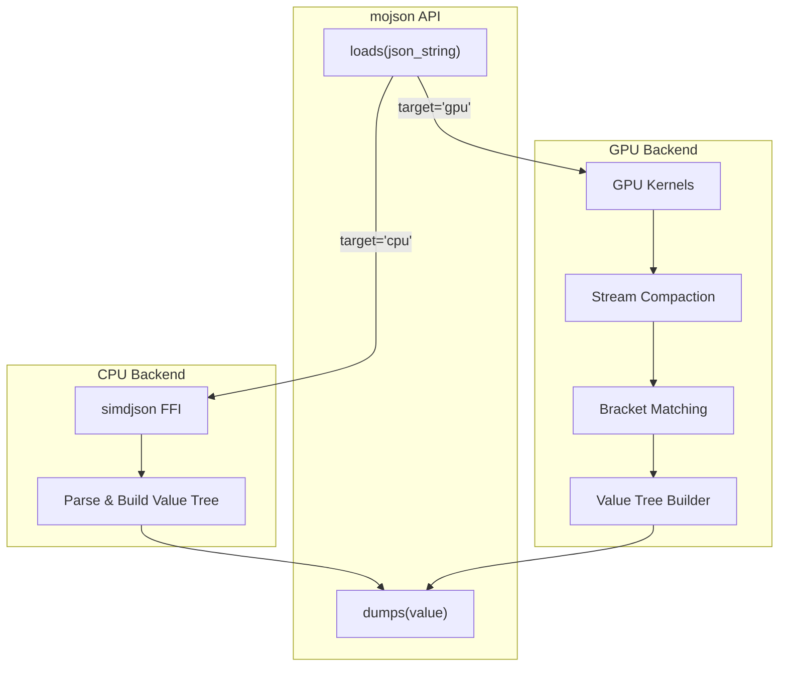
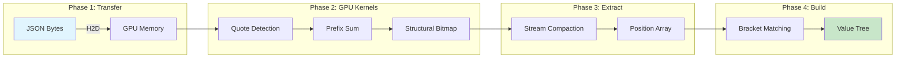

# Architecture

mojson provides a unified API with two high-performance backends: CPU (simdjson FFI) and GPU (native Mojo kernels).

## System Overview



## CPU Backend

**Implementation:** FFI wrapper around [simdjson](https://github.com/simdjson/simdjson)

**Location:**
- `src/cpu/simdjson_ffi/` - C++ wrapper
- `src/cpu/simdjson_ffi.mojo` - Mojo FFI bindings

**Performance:** ~3.5 GB/s (within 20% of native simdjson)

### CPU Parsing Flow

1. Load JSON string into memory
2. Call simdjson via FFI (`src/cpu/simdjson_ffi.mojo`)
3. Recursively build `Value` tree from simdjson result
4. Return parsed `Value`

## GPU Backend

**Implementation:** Native Mojo GPU kernels inspired by [cuJSON](https://github.com/AutomataLab/cuJSON)

**Location:**
- `src/gpu/parser.mojo` - Main GPU parser
- `src/gpu/kernels.mojo` - CUDA-style GPU kernels
- `src/gpu/stream_compact.mojo` - GPU stream compaction for position extraction
- `src/gpu/bracket_match.mojo` - CPU bracket matching

**Performance:** ~8.5 GB/s on NVIDIA B200 (1.85x faster than cuJSON)

**Techniques:**
- Bitmap-based parsing
- Parallel prefix sums
- GPU stream compaction for position extraction
- Hybrid GPU/CPU pipeline

### GPU Pipeline



### GPU Parsing Flow

1. **Host-to-Device Transfer:** Copy JSON bytes to GPU using pinned memory (HostBuffer) for fast transfer (~15ms for 804MB)
2. **GPU Kernels:** Execute parallel kernels to:
   - Create bitmaps for quotes, escapes, structural characters
   - Compute parallel prefix sums to identify in-string regions
   - Extract structural character bitmap
3. **Stream Compaction (GPU):** Extract only the positions of structural characters (~50ms)
4. **Device-to-Host Transfer:** Copy compact position array back to CPU
5. **Bracket Matching (CPU):** Match brackets using stack algorithm (~10ms)
6. **Value Tree Construction (CPU):** Build `Value` tree from structural info

### Why Hybrid GPU/CPU?

- **GPU excels at:** Parallel bitmap operations, prefix sums, stream compaction
- **CPU excels at:** Sequential bracket matching, tree construction with dynamic memory
- **Key insight:** GPU stream compaction dramatically reduces D2H transfer size (from 465MB to <10MB for 804MB input)

## Value Type

The `Value` struct represents any JSON value (null, bool, int, float, string, array, object).

See [API Reference](./api.md) for complete `Value` methods.

## Directory Structure

```
src/
├── __init__.mojo              # Public API exports
├── parser.mojo                # Unified CPU/GPU parser, loads/load functions
├── serialize.mojo             # dumps/dump functions
├── value.mojo                 # Value type definition
├── types.mojo                 # JSONInput, JSONResult types
├── iterator.mojo              # JSONIterator for traversing results
├── ndjson.mojo                # NDJSON parsing/serialization
├── lazy.mojo                  # On-demand lazy parsing
├── streaming.mojo             # Streaming parser for large files
├── config.mojo                # Parser/Serializer configuration
├── errors.mojo                # Error formatting with line/column
├── unicode.mojo               # Unicode escape handling
├── patch.mojo                 # JSON Patch & Merge Patch (RFC 6902/7396)
├── jsonpath.mojo              # JSONPath query language
├── schema.mojo                # JSON Schema validation
├── cpu/
│   ├── simdjson_ffi.mojo     # simdjson FFI bindings
│   └── simdjson_ffi/         # C++ simdjson wrapper
└── gpu/
    ├── parser.mojo            # GPU parser implementation
    ├── kernels.mojo           # GPU kernel functions
    ├── stream_compact.mojo    # GPU stream compaction
    └── bracket_match.mojo     # CPU bracket matching

tests/
├── test_value.mojo            # Value type tests
├── test_parser.mojo           # Parser tests (loads)
├── test_serialize.mojo        # Serialization tests (dumps)
├── test_ndjson.mojo           # NDJSON tests
├── test_lazy.mojo             # Lazy parsing tests
├── test_streaming.mojo        # Streaming parser tests
├── test_config.mojo           # Config tests
├── test_patch.mojo            # JSON Patch tests
├── test_jsonpath.mojo         # JSONPath tests
├── test_schema.mojo           # JSON Schema tests
└── test_gpu.mojo              # GPU parser tests

benchmark/
├── datasets/                  # Benchmark files
├── mojo/
│   ├── bench_cpu.mojo        # CPU benchmark (mojson vs simdjson)
│   └── bench_gpu.mojo        # GPU benchmark (mojson vs cuJSON)
└── cuJSON/                    # cuJSON submodule for comparison
```

## Build & Test

```bash
# Build simdjson FFI wrapper
pixi run build

# Run tests
pixi run tests-cpu  # CPU parser tests
pixi run tests-gpu  # GPU parser tests

# Benchmarks
pixi run bench-cpu   # CPU: mojson vs simdjson
pixi run bench-gpu   # GPU: mojson only
pixi run bench-gpu-cujson  # GPU: mojson vs cuJSON
```

## Dependencies

- **Mojo:** Latest nightly (with GPU support)
- **simdjson:** Git submodule in `src/cpu/simdjson_ffi/simdjson/`
- **cuJSON:** Git submodule in `benchmark/cuJSON/` (for comparison only)
- **CUDA:** Required for GPU backend and benchmarks
